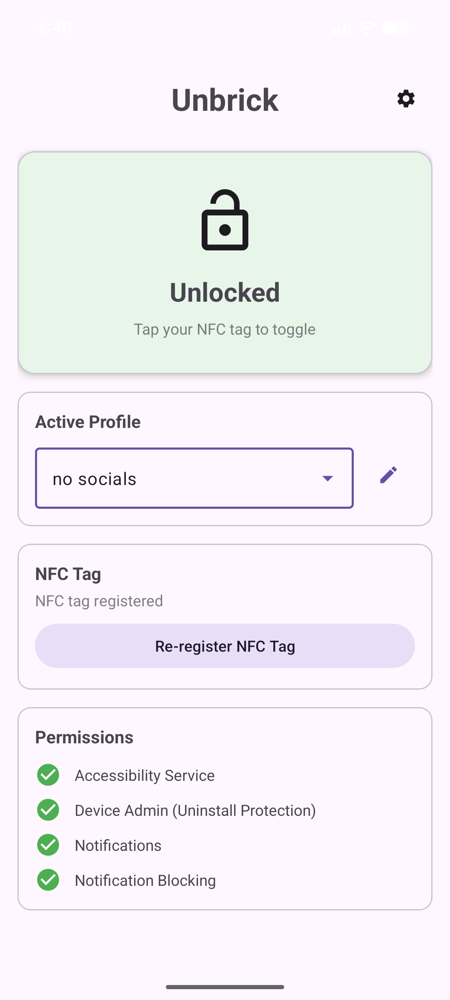

# Unbrick



An open-source Android app that helps you manage phone addiction by restricting app access until you tap an NFC tag. Works with any NFC tag your phone can read, including many credit/debit cards, transit cards, key fobs, etc.

## Features

- **NFC-based locking**: Register any NFC tag to toggle app restrictions
- **Flexible blocking modes**:
  - **Blocklist mode**: Block specific apps when locked
  - **Allowlist mode**: Only allow specific apps when locked
- **Bypass protection**:
  - Device Admin prevents app uninstallation
  - Accessibility Service detects and blocks restricted apps
  - Settings app can be blocked to prevent disabling protections
  - Lock state persists through reboots
- **Emergency unlock**: Time-delayed unlock (default 1 hour) if you lose your NFC tag
- **Lock without NFC**: long-press the main button to lock without using the NFC tag (tag still required for unlock)

## Installation

Download the latest APK from the [Releases](../../releases) page.

### Sideloading on Android

1. On your Android device, go to **Settings > Security** (or **Settings > Apps > Special access**)
2. Enable **Install unknown apps** for your browser or file manager
3. Download the APK and open it
4. Tap **Install** when prompted
5. After installation, you can disable "Install unknown apps" for security

Note: You may see a "Play Protect" warning since the app isn't from the Play Store. Tap **Install anyway** to proceed.

## Setup

1. Install the APK
2. Enable the Accessibility Service in Settings > Accessibility > Unbrick
3. Enable Device Admin when prompted
4. Register an NFC tag by tapping it to your phone
5. Select which apps to block/allow
6. Tap your NFC tag to lock!

## Building from source

```bash
./gradlew assembleDebug
```

The APK will be at `app/build/outputs/apk/debug/app-debug.apk`.

See `CLAUDE.md` for instructions on running tests.

## Acknowledgments

Inspired by [Brick](https://getbrick.app/), a commercial solution with similar functionality.

All code written by Claude Opus 4.5.